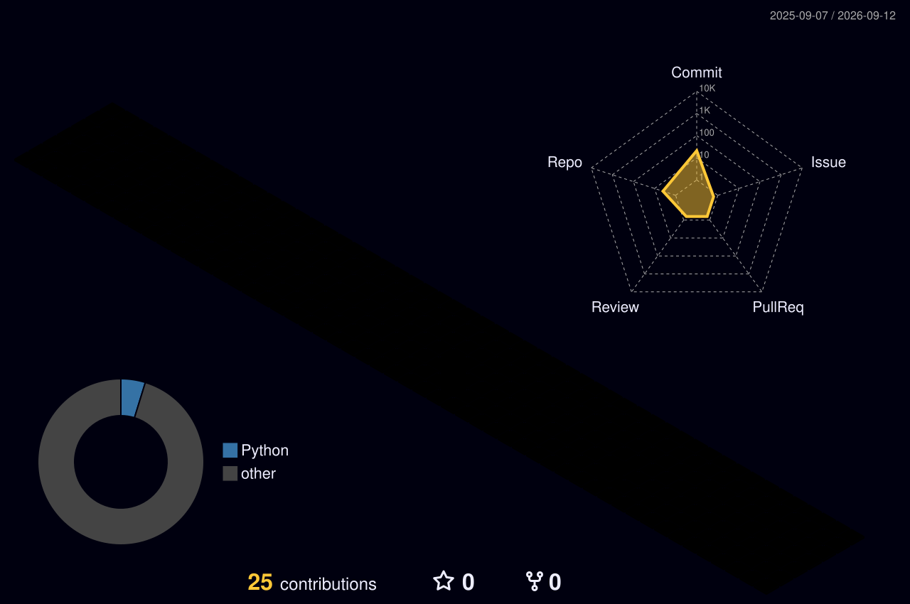

<h1 align="center">Hi 👋, I'm Deepak Kumar Vishwakarma</h1>
<h3 align="center">A passionate developer from India 🚀</h3>

---

### 💼 About Me
- 🔭 I’m currently working on **Innovative Development Projects**
- 🌱 I’m currently learning **Advanced Web Development & Game Development**
- 👯 I’m looking to collaborate on **Open Source & Game Dev Projects**
- 💬 Ask me about **Python, C/C++, Java, React, Django, Unity, Unreal Engine**
- 📫 How to reach me: **example@gmail.com**
- ⚡ Fun fact: **I think I am funny 😄**

---

### 🛠️ Languages & Tools

#### 👨‍💻 Programming Languages

  

#### 🌐 Frontend Development

  

#### ⚙️ Backend Development

  

#### 🗄️ Database

  

#### 🎮 Game Development

  
  

---

### 📊 GitHub Stats

  

  

---

### 🏆 GitHub Trophies

  

---

### 🌐 Connect with Me

  <a href="https://linkedin.com/in/YOUR_LINKEDIN">LinkedIn</a> |
  <a href="https://github.com/YOUR_USERNAME">GitHub</a>

---

⭐️ From [Deepak Kumar Vishwakarma](https://github.com/YOUR_USERNAME)
